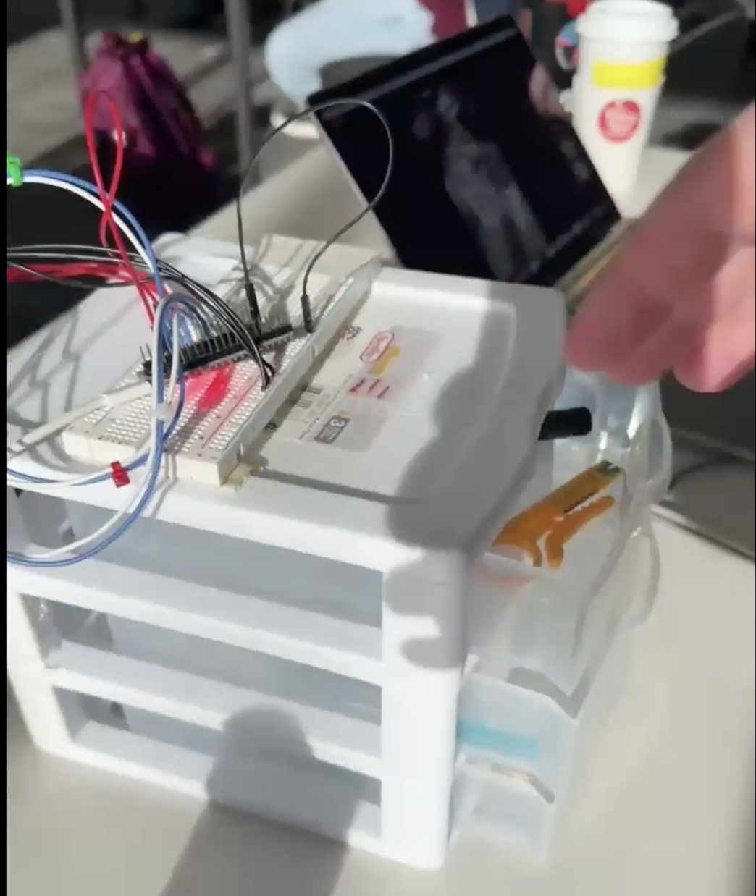
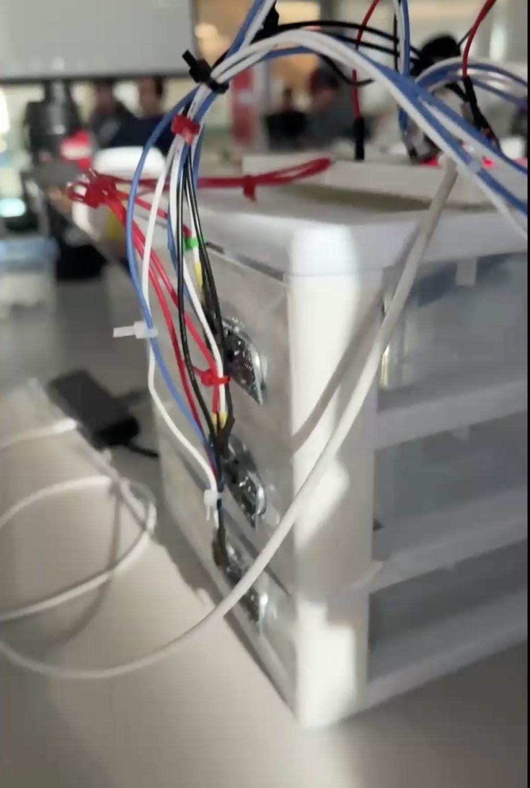
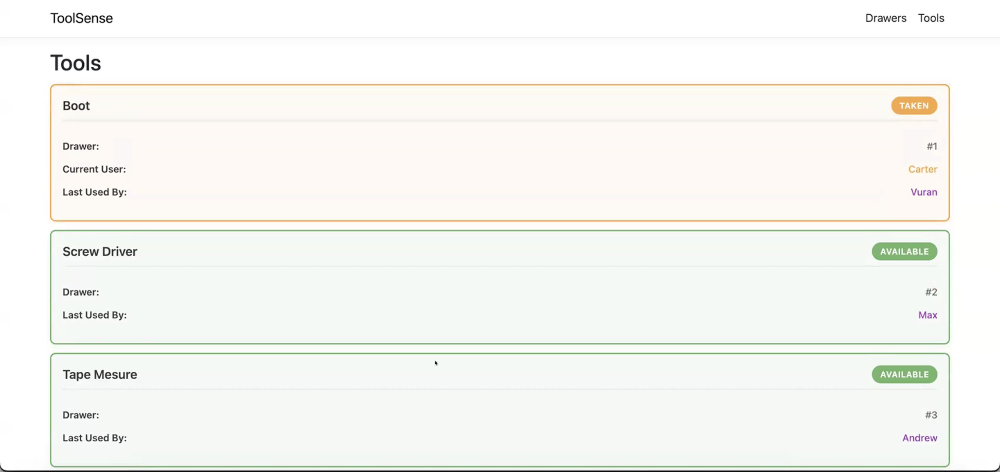
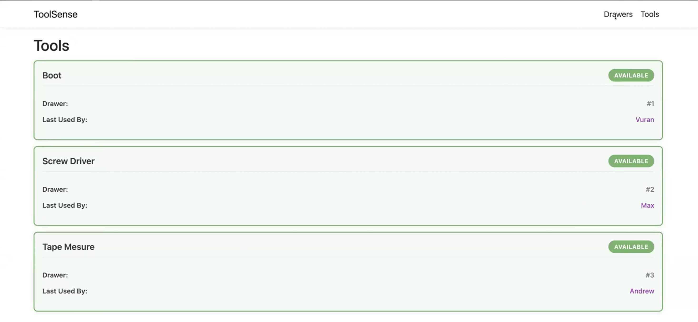
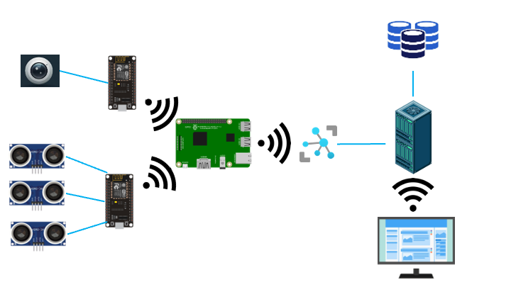
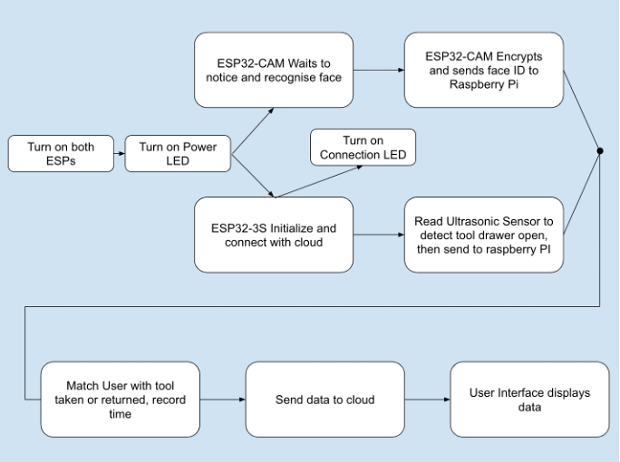

# Intro
This project was completed as a final for my IOT class, this was completed as a team. 

link to the original [repo](https://gitlab.com/carter-fogle/toolsense)

ToolSense was created using a Esp32, Esp32-Cam, and a Rasberry Pi 5. The system consisted of a camera module, drawer sensor stand, gateway, and web interface that all linked to gether to give a live feed of a tool box's status including its tools and users.

### Project Features
- Created Drawer module that detected drawer state and communicted with rasberry pi gateway
- Created Camera module that detected faces, encoded them and sent the bimetrics to gateway
- Implemeted gateway that held local face data that was used to recognise tool users and determine tool status
- Used Azure IoT hub to store systems telemetry data and error information
- C# and React web interface to veiw live data from system
- achieved less than second delay to update system changes.


### Reuslt Images
##### Drawer Modue



##### Web Interface



# Toolsense

Toolsense is a smart asset tracker system designed for unorganized toolboxes, like toolboxes without foam inserts, and intended to be a cheap solution for shops. 

The system consists of a few differenet components: A central hub which also acts as a gateway device, a small wireless camera sensor, and a small wireless drawer sensor that can behooked up to multiple drawers. 

The central hub is a Raspberry Pi, any Raspberry Pi after pi 3 should work, it needs a wlan interface for communication and preferably a ethernet interface for configuration, but not required. The camera is a small ESP32-cam module. The drawer handler is another generic ESP32 controller with ultrasonic sensors for every drawer you want equipped. Currently a IoT Hub is used for retrieving information from the Raspberry Pi and a small server with a simple csv database is setup on a local host. 

## Setting up and running the project

Here is how the data flows and how the overall system operates:



*System Overview*



*Software Flow*

### Network

For this project to work correctly it does require a few networking requirements. First of all a network with client to client communication must be used, since video streaming from the cam to the pi is client to client communication. A phone hotspot works as well as home networks, but for enterprise networks, an administrator would likely need to be contacted.

### Raspberry Pi

As mentioned before a ethernet interface is highly recommended to setup the Raspberry Pi, however, connecting the pi over wlan is also okay. As long as you are able to ssh into the Raspberry Pi it will be okay.

Be sure to download Raspberry Pi OS (64-bit) Debian Trixie port onto the Pi. Headless should work because all the setup can happen over SSH, but to make your life easier having a desktop is always nice.

Would highly recommend the [Raspberry Pi imager tool](https://www.raspberrypi.com/software/) to install operating system to SD card for the pi.

Upon install of the OS, ssh into the Pi. Then clone the repository into the home directory of the pi. In the directory `~/raspberrypi_hub/` there is a setup script, `raspberry_pi_hub`, that should work out of the box on raspberry pi OS. You may need to add permission to execute the file: `chmod +x ~/raspberrypi_hub/raspberry_pi_setup.sh`

This sets up a vitrual enviroment to run the correct versions of python on the pi. Activate the virtual enviroment `source ~/toolsense-venv/bin/activate` 

Now the pi is ready to run the hub code, `python ~/raspberrypi/hub/main.py` should run the code.

The python script outputs its wlan IP address, this will be needed for the two ESPs. The python output should say this first:

```
Display video? (needs graphics support, hint check echo $DISPLAY)
Y/n: n
[HUB] Your Raspberry Pi IP is: **192.168.1.178**
[HUB] Enter this IP on the ESP32 when it asks.

Waiting for ESP32 to connect...

Connected to IoT Hub
Waiting on drawer handler connection on 0.0.0.0:5002
```
This means the hub is waiting for a connection from the drawer handler, you will need to setup the drawer handler. 

Then after this is setup it will do the same for the ESP-CAM, then you will need to setup the CAM next. 

I should also mention the IoT Hub access key is in the main file, please change that to your own IoT Hub key. 

The code should output the wlan interface IP address, save this to input to other components. But the pi should wait for the other devices to connect before it starts.

### ESP32 - Drawer Handler

To setup the drawer handler you will need to get the code from the `drawer_handler` directory and put it on an ESP32. Before you upload change the IP address global varible to the IP the raspberry pi output. Be sure to hookup the ultrasonic sensors for the drawers in the following pin map configuration:

[Schematic](images/Toolsense3Sensors_bb.pdf)

The current setup is only for 3 sensors (3 drawers) but is modular until pins on the device are filled up.

Now once the code is on the device it should try to ping the raspberry pi, the serial port has debug messages on it, but should also be visable on the pi when the drawer-handler connects.

### ESP32-Cam

Clone the repo, onto a device capable of uploading code to the ESP32-Cam. During development PlatformIO was used for development so you could import a PlatformIO project by selecting the directory `camera_node/platformIO/` from the git repo. This contains all of the setup parameters for the CAM. However, this can also be configured on Ardiuno IDE. IMPORTANT NOTE: The board that was used for this project was AI Thinker board. 

After you get the code on the ESP32-CAM, you will need access to it's serial port to input the Pi's IP Address.

Once input the device should say connected and streaming information, it is at this point code will start on the pi.

### Server setup

Now to setup the server. There are two parts the python script that updates the database then the website.

#### Website
To start the website download and install [dotnet 10.0.0](https://dotnet.microsoft.com/en-us/download/dotnet/10.0).

Now open a terminal in the server directory of the project and run the command `dotnet run`. This setups the website server. In the terminal there should be a line like:

```
info: Microsoft.Hosting.Lifetime[14]
      Now listening on: https://localhost:7075 
```

Hover over the link and click on it, this will launch a proxy and open your default browser. Now back in the terminal there should be confirmation:

```
Compiled successfully!

You can now view toolsense.webapp in the browser.

  Local:            http://localhost:44479
  On Your Network:  http://192.168.1.56:44479
```

Click on the Local option if you are on the machine that started the server, however, if you want to access the app from another device on the network click the "On Your Network" option.

The webapp is now running.

#### Server

The server is just a python script that updates the Drawerinfo.csv file, which contains toolbox information. This python script listens for messages through the IoT Hub and when recieve a message it will update the CSV file with our business logic. 

To set this up run the `server_setup.sh` or `server_setup.bat` for windows to setup the python virtual enviroment for the server. Once this is ran you may need to update the files permissions. `chmod +x server_setup.sh` 

After this activate the virtual enviroment: `source toolsense-venv/bin/activate`

Then run the script `python server.py`

Currently a tool is assigned to every drawer, the logic will assume a tool is taken if a user opens and closes the drawer for the first time, and that it is returned if a drawer is opened then closed and that user is the current user. This is were the actual facial recognition happens.

To add users, with the person's permission, create a new sub directory under the server/know_faces/ directory with their name. Then add two pictures there and then restart the server if it is already started. Consider as more users are added the server may take longer to initialize.

## Information

You can find error messages in each module's serial output.
